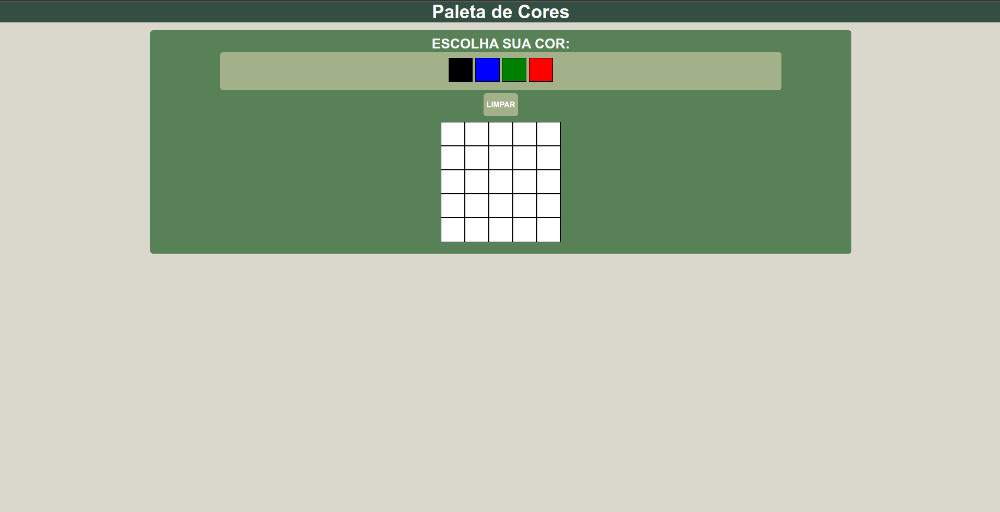

# Seja bem-vindo ao projeto Pixels Art!! 🎨🖌️

#### Esse projeto tem como objetivo propor uma tela de pixel arte onde o usuário pode selecionar uma das cores disponiveis na tabela e pintar a tela do modo que desejar, tendo também as opções de limpar a tela e escolher o tamanho da mesma.

  

## Tecnologias :

<ul>
  <li>HTML</li>
  <li>CSS</li>
  <li>Java Script Vanilla</li>
</ul>

## Como executar:

<ul>
  <li>Clone em seu computador (via SHH)</li>    
  <li>instale a extenção Live Server em seu VSCode e execute</li>
</ul>

## Também disponível em:

### <a href="https://pixels-fvf34yexa-cozmu.vercel.app/" ><b>Pixels Art</b></a>

## Como contribuir no projeto:
  1. Faça um **fork** do projeto;
  2. Crie uma nova branch com as suas alterações: `git checkout -b my-feature`;
  3. Salve as alterações e crie uma mensagem de commit contando o que você fez: `git commit -m "feature: My new feature"`;
  4. Envie as suas alterações: `git push origin my-feature`;
  5. Abra o seu pull-request na página do GitHub.  

## Licença:

 Esse projeto está sob a licença: 
 
 

##  Autor:

### <a href="https://www.linkedin.com/in/jorge-reis-dev/" ><b>Jorge Wellington.</b></a>
